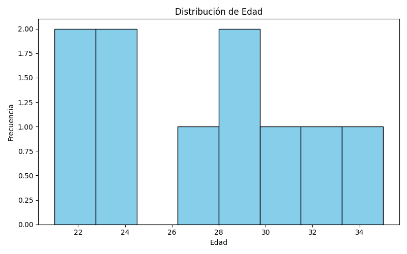
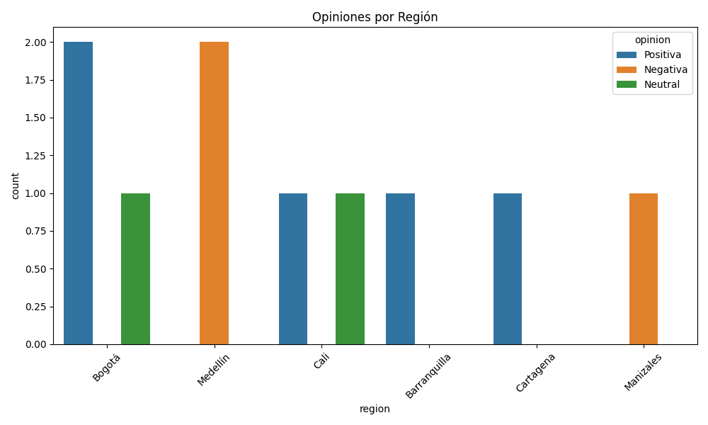

# Informe de Resultados

**Resumen**

Este informe presenta los resultados obtenidos a partir de los datos recolectados. A continuación se muestran las gráficas generadas a partir del análisis:

## Distribución de Edad

## Opiniones por Región

## Distribución de Opiniones

**Conclusión**

La mayoría de los encuestados tiene una opinión positiva y se concentra en ciertas regiones. Estos datos pueden servir para futuras investigaciones.
